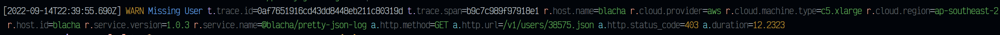

# Pretty Json Log (PJL)

Convert JSON log lines into simple pretty colored log output

Converts

```json
{"pid":0,"time":"2019-11-03T00:48:55.623Z","hostname":"","level":30,"msg":"HTTPGet","v":0,"name":"cogview","firstChunk":0,"lastChunk":0,"chunkCount":1,"bytes":32768,"fetchRange":"bytes=0-32768"}
{"pid":0,"time":"2019-11-03T00:48:55.677Z","hostname":"","level":30,"msg":"HTTPGet","v":0,"name":"cogview","firstChunk":94,"lastChunk":95,"chunkCount":1,"bytes":32768,"fetchRange":"bytes=3080192-3145728"}
```

into




## Install

```bash
npm i -g pretty-json-log

cat <log-file> | pjl 
```

Logs can be filtered using `--level`

```
cat <log-file> | pjl --level 20
```

### OpenTelemetry Log options

Do not output `Resources` 

```
cat <log-file> | pjl --ignore-resources
```

## Basic log type

To be pretty printable the basic json line needs to have:

Either:

1. A PinoJS log message

```typescript
/** Base log object every log object should have at minimum these three keys */
export interface LogMessage extends Record<string, any> {
    /** Log level */
    level: number;
    /** Time stamp either a ISO8601 string, timestamp number in ms or a Date */
    time: number | string | Date;
    /** Log message */
    msg: string;
}
```

2. A [OpenTelemetry](https://github.com/open-telemetry/opentelemetry-specification/blob/main/specification/logs/data-model.md) Log Message

```typescript
export interface LogMessageOpenTelemetry {
    /** Timestamp in nanoseconds if a string, or ms if a number */
    Timestamp: number | string
    /** Message body */
    Body?: unknown;
    Resource?: Record<string, unknown>;
    Attributes?: Record<string, unknown>;
}
```